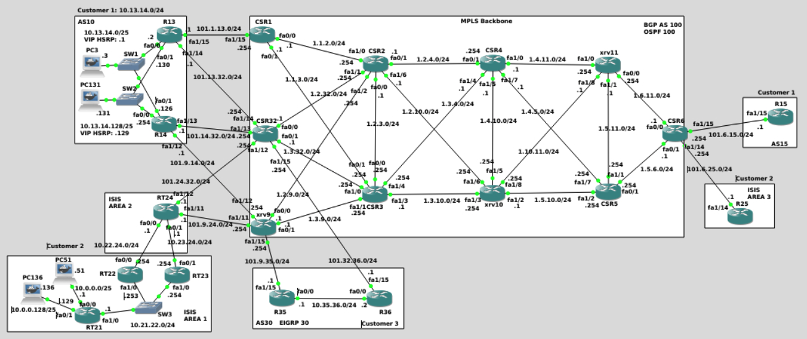

# Service Provider Core Simulation

This project simulates a Service Provider MPLS backbone using **GNS3** and **Cisco IOS/IOS-XE** devices.

The goal is to design and implement a scalable, redundant, and resilient ISP core network capable of providing connectivity between geographically **distributed customer sites**, each with its own internal architecture and different routing / QoS requirements.

The backbone runs **IPv4** and provides **isolated VPN services** using **MPLS L3-VPN** technology. It covers Service Provider well-known design principles, such as:

- Control Plane vs Data Plane separation
- MPLS efficient forwarding and load balancing
- Backup and redundancy
- Scalability

  

NOTE: The full GNS3 source file is available upon request to protect intellectual property. Please reach out at simone.bussa@libero.it if you'd like to review the full project.

---
## Main features

- MPLS/LDP enabled core backbone
- OSPF as the IGP for the MPLS underlay
- VRF instances with Route Distinguisher (RD) and Route Targets (RT) per customer
- PE–CE routing protocols (eBGP, EIGRP, RIP, static routing)
- MP-BGP (VPNv4) to exchange VPN routes between PE routers
- Customer internal routing protocols (multi-area IS-IS, iBGP)

---
## Additional features

- Route Reflector design to avoid full-mesh iBGP between PEs
- HSRP for gateway redundancy inside customer networks
- BGP conditional advertisement and route map filters (route-map in/out, advertise-map, exist-map)
- AS-path prepending and BGP metric manipulation to prefer specific PE paths
- IS-IS DIS election and route aggregation
- BGP Site-of-Origin (SoO) extended community to prevent routing loops in multi-homed VPN sites

---
## Repository Content

This repository contains the following documentation:
- README.md - Project documentation
- documentation.md - Additional details and configurations
- /images/ - Screenshots of GNS3 topology
