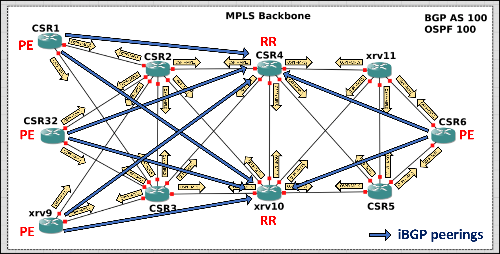

# Additional documentation

This document provides a technical deep-dive into the architecture of the Service Provider backbone area and Customer sites.

## MPLS Backbone Architecture (AS 100)

The core of the infrastructure is an MPLS Backbone operating under Autonomous System 100.

- **IGP and Label distribution**: Every core-facing interface within the backbone is configured with OSPF. This protocol serves as the Interior Gateway Protocol (IGP) to establish full IP reachability across the core and to build the Routing Information Base (RIB). LDP (Label Distribution Protocol) is enabled on the same interfaces. It relies on the OSPF reachability to distribute MPLS (Transport) labels, effectively building the Label Forwarding Information Base (LFIB) for end-to-end Label Switched Paths (LSPs).

- **BGP Control Plane**: Provider Edge (PE) routers (CSR1, CSR32, XRV9, CSR6) implement MP-BGP to exchange customer learned routes. VPNv4 address-family is used for the transport of overlapping private IP spaces by prepending a 64-bit Route Distinguisher (RD) to the customer's IPv4 prefixes. Each customer is isolated into a dedicated VRF instance. Logical separation and route propagation are managed via Route Targets (RT), ensuring that prefixes are imported and exported only to the intended customer sites.

- **Route reflectors**: To overcome the scalability limitations of a Full-Mesh iBGP peering requirement between PEs, the network adopts a Route Reflector hierarchy. Two RRs (CSR4 and XRV10) are configured to redistribute VPNv4 routes (from customers) and VPN labels among PEs, ignoring the iBGP split-horizon rule and reducing the number of required BGP peerings. Each PE maintains simultaneous iBGP sessions with both CSR4 and XRV10 for high availability.

  

