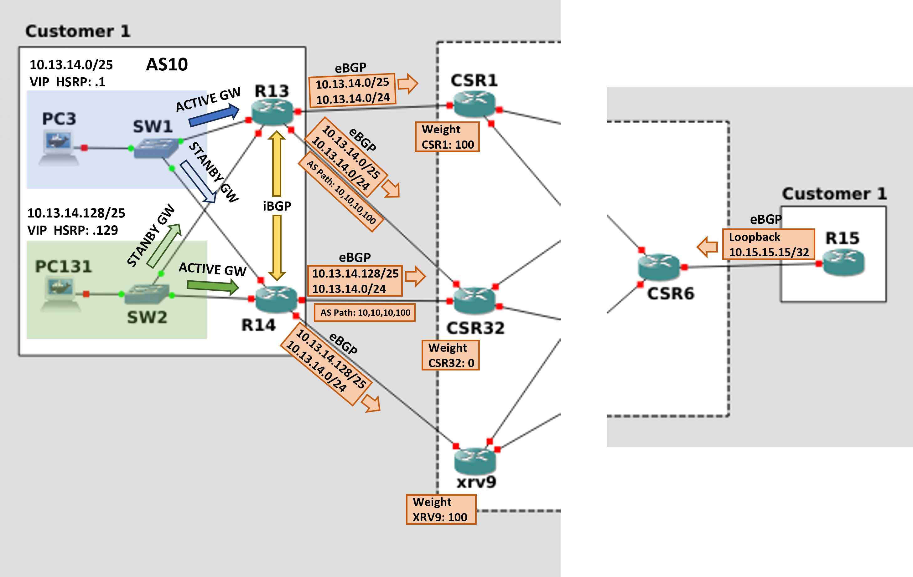
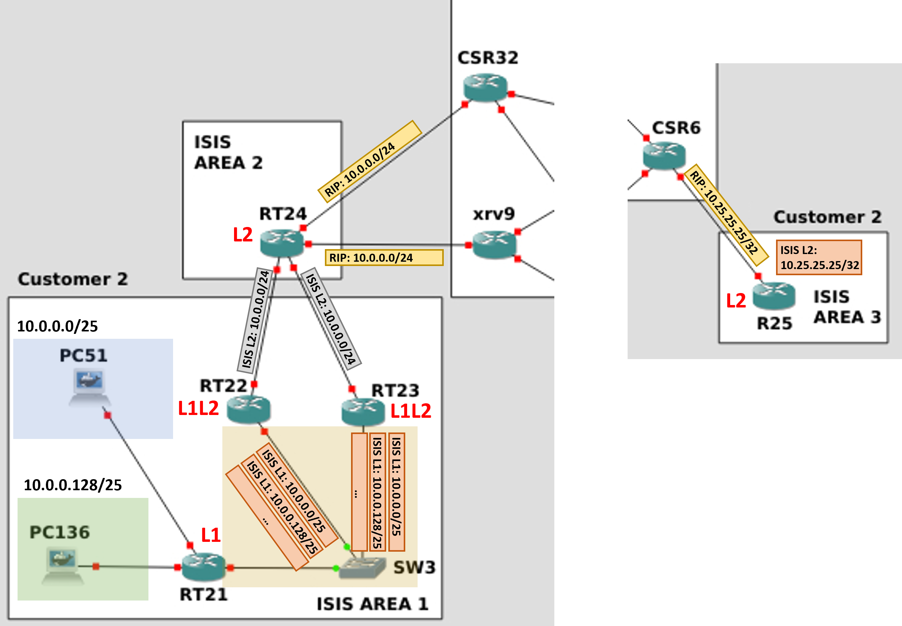

# Additional documentation

This document provides a technical deep-dive into the architecture of the Service Provider backbone area and Customer sites.

## MPLS Backbone Architecture (AS 100)

The core of the infrastructure is an MPLS Backbone operating under Autonomous System 100.

- **IGP and Label distribution**: Every core-facing interface within the backbone is configured with OSPF. This protocol serves as the Interior Gateway Protocol (IGP) to establish full IP reachability across the core and to build the Routing Information Base (RIB). LDP (Label Distribution Protocol) is enabled on the same interfaces. It relies on the OSPF reachability to distribute MPLS (Transport) labels, effectively building the Label Forwarding Information Base (LFIB) for end-to-end Label Switched Paths (LSPs).

- **BGP Control Plane**: Provider Edge (PE) routers (CSR1, CSR32, XRV9, CSR6) implement MP-BGP to exchange customer learned routes. VPNv4 address-family is used for the transport of overlapping private IP spaces by prepending a 64-bit Route Distinguisher (RD) to the customer's IPv4 prefixes. Each customer is isolated into a dedicated VRF instance. Logical separation and route propagation are managed via Route Targets (RT), ensuring that prefixes are imported and exported only to the intended customer sites.

- **Route reflectors (RRs)**: To overcome the scalability limitations of a Full-Mesh iBGP peering requirement between PEs, the network adopts a Route Reflector hierarchy. Two RRs (CSR4 and XRV10) are configured to redistribute VPNv4 routes (from customers) and VPN labels among PEs, ignoring the iBGP split-horizon rule and reducing the number of required BGP peerings. Each PE maintains simultaneous iBGP sessions with both CSR4 and XRV10 for high availability.

  

## Customer 1 Architecture (AS 10, AS 15)

The connectivity for Customer 1 (AS 10 and AS 15) is designed for high availability and specific routing requirements, using a multihomed approach toward the Service Provider backbone. In particular, the design objectives are: 

1) The 10.13.14.0/24 prefix must be logically divided into two segments to achieve deterministic **load sharing**. The first half of addresses in 10.13.14.0/24 must use R13 to exit onto the SP, while the second half must use R14. In the event of a failure of one of these two routers, the affected segment must automatically transition to the remaining router, which provides a secondary path to the SP, guaranteeing uninterrupted reachability for the entire customer subnet.
2) When connecting to the Service Provider, each CE router (R13 and R14) must maintain a primary link (R13-CSR1 and R14-XRV9) and a shared backup link via CSR32 for **path redundancy**, in the event the primary link fails.

This is how the objectives are achieved. 

- **LAN division and HSRP**: The subnet 10.13.14.0/24 is split into two /25 segments using HSRP for gateway redundancy. VLAN A (10.13.14.0/25): R13 is the Active Gateway; R14 acts as Standby. VLAN B (10.13.14.128/25): R14 is the Active Gateway; R13 acts as Standby.

- **CE-PE BGP**: CE routers use eBGP to exchange customer ipv4 prefixes with the SP. R13 advertises 10.13.14.0/25, while R14 advertises 10.13.14.128/25 (specific). Both two routers also advertise 10.13.14.0/24 (summary), to ensure reachability during partial failures (e.g., should either R13 or R14 fail). R13 and R14 use BGP conditional advertisement: if a specific local /25 prefix is lost (e.g., internal interface down), the router stops advertising the /24 summary to prevent black-holing traffic.

- **CE-PE primary links (CSR1, XRV9) and CSR32 for backup**: for outbound traffic (Customer->SP), R13/R14 use the BGP Weight attribute to prioritise routes through CSR1 and XRV9 respectively. CSR1/XRV9 are assigned Weight 100, while the backup neighbor CSR32 is assigned the default 0. This ensures the primary link is always preferred if up by R13/R14. For inbound traffic (SP->Customer), to discourage the SP from using the backup paths, AS-Path Prepending is applied. R13 and R14 prepend their AS multiple times (10, 10, 10, 100) when advertising to CSR32, making the backup path appear more expensive to the SP core.

- **iBGP internal peering**: An iBGP peering is established between R13 and R14 using Loopback interfaces. This peering is crucial for maintaining connectivity if a CE's WAN interfaces (both primary and backup) fail. It allows the isolated router to learn external prefixes from its iBGP neighbor. Static routes with ECMP provide reachability for the neighbor's Loopback via the two internal switches (SW1/SW2). Route-maps are applied to R13/R14 to ensure that prefixes learned via iBGP are not re-advertised back to the Service Provider by eBGP.

  

Possible failure scenarios (e.g., on R13):

- Primary Link Failure (e.g., R13 to CSR1): R13 still has two routes to the SP: one via CSR32 (eBGP, weight default = 0) and one via R14 (iBGP, weight default = 0). R13 will use the eBGP path through CSR32, as eBGP routes are preferred over iBGP routes.

- Failure of both WAN links (e.g., R13 to CSR1 and to CSR32): If R13 loses both SP links, it routes traffic internally to R14 via iBGP. Since HSRP tracking is not used, R13 remains the Active Gateway for the internal subnet 10.13.14.0/25, but forwards packets to R14 to reach the SP.

- Internal Switch Failure: If R13 loses its internal interface to SW1, HSRP fails and R14 become the Active GW for 10.13.14.0/25. All internal hosts will use R14 to reach the SP (without passing through R13). Because of th BGP conditional advertisement, R13 stops advertising both /25 and /24 eBGP customer prefixes. The SP automatically converges to R14 for all Customer traffic using the /24 summary notified by R14.

## Customer 2 Architecture (AS 20)
Customer 2 implements a hierarchical IS-IS infrastructure for its internal network, integrated with a RIP-based PE-CE connectivity. 

- **Internal IS-IS network**: RT21 (Level 1) in Area 1 acts as the access layer for the 10.0.0.0/24 subnet. It is elected as the DIS (Designated Intermediate System) for the broadcast segment on SW3. RT22 and RT23 (Level 1/Level 2) act as the boundary between Area 1 and Area 2. RT24 (Level 2) in Area 2 serves as the backbone router handling external peering.

- **ISIS NET addresses**: Each node is identified by a unique NSAP address, following the Area.SystemID.NSEL format.

- **ISIS route advertising and filtering**: RT21 advertises both 10.0.0.0/25 and 10.0.0.128/25 L1 ISIS routes. RT22 and RT23 aggregate the two /25 subnets from RT21 into a single L2 10.0.0.0/24 summary (Route aggregation). RT22 and RT23 also apply route filtering to hide internal point-to-point prefixes, ensuring only the aggregate PC subnets are advertised to the L2 domain (RT24).

- **PC traffic load balancing**: Traffic originating from the customer subnet (10.0.0.0/24) is load-balanced between RT22 and RT23. By default, RT21 identifies both L1/L2 routers as valid exit points for Area 2, distributing traffic across both paths. To prioritize a specific path, the cost of the links connecting RT22/RT23 to RT24 can be adjusted, and Route Leaking can be implemented to propagate specific L2 topology information back into the L1 area (and thus to RT21).

- **CE-PE Connectivity via RIP**: RIP is used to connect PEs and CEs and redistribute routes between the customer and the SP. Concerning internal destinations, RT24 redistributes L2 IS-IS routes into the RIP process. RT24 internal interfaces are set to RIP passive-interface and route map filters are used to ensure that only internal customer routes are advertised to PEs by RT24. This prevents RT24 from propagating RIP routes learned from one PE to the other, thus eliminating the risk of the SP Core using the Customer network as a backup path (which could occur because RIP's Administrative Distance is typically favored over the iBGP). When receiving RIP routes from the CEs, PEs routers (CSR32, XRV9) redistribute them into BGP towards the MPLS core. The PE on the other side of the SP receives BGP routes from the MPLS core, redistribute them into RIP toward the CE, and finally the CE into ISIS as Level 2 routes, to be forwarded to the internal customer network. 

  

